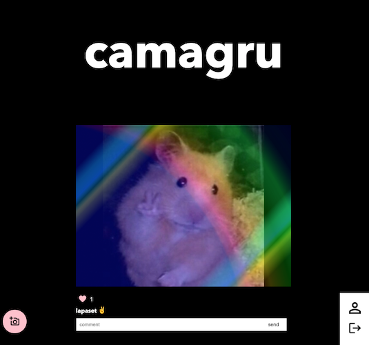
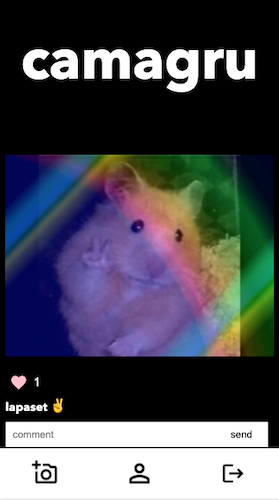
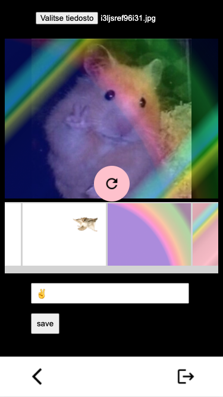
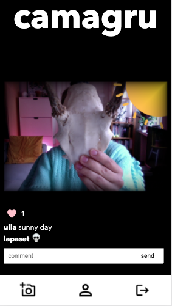

# camagru
A responsive photo sharing app, PHP+MySQL, Hive Helsinki school project.
Only runs locally atm.

 

Features:
- register user
- browse, comment and like photos
- use the webcam or upload a photo
- add filters and description
- manage your profile information and photos

